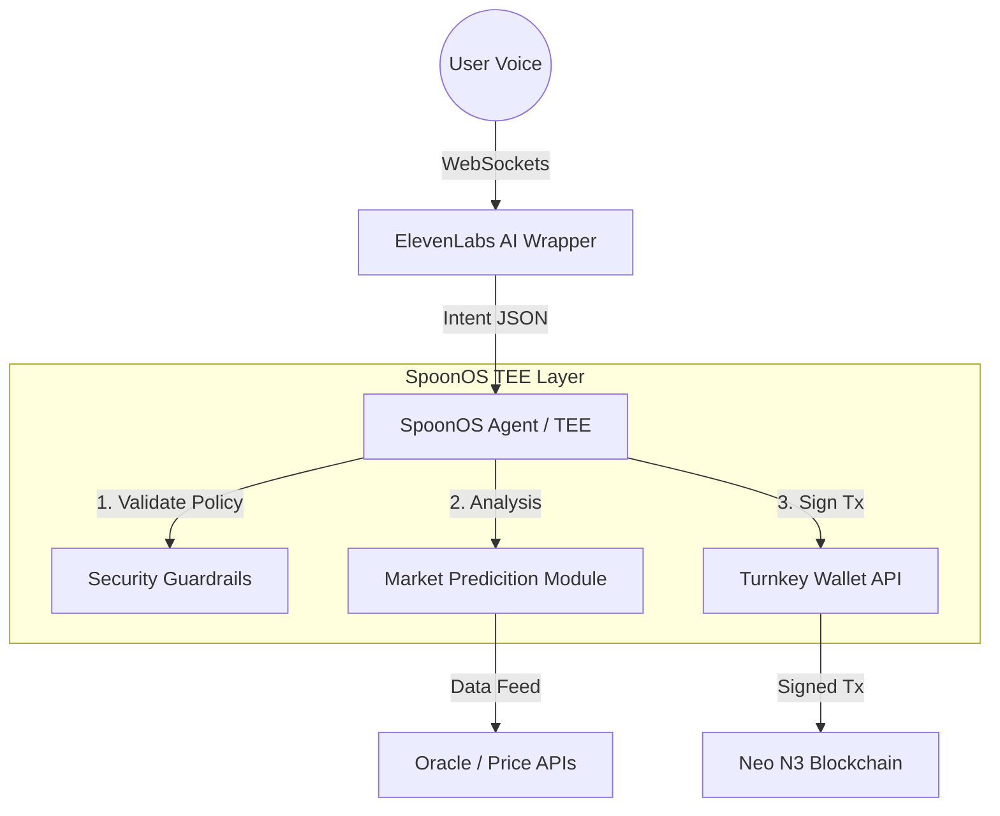

# flowchain - Voice-Native Smart Crypto Wallet

## 1. Abstract

**flowchain** is a non-custodial, voice-activated agentic interface for the Neo blockchain, designed to eliminate the latency and physical constraints of traditional hardware and browser-based wallets. By leveraging **SpoonOS** for secure Trusted Execution Environments (TEEs) and **ElevenLabs** for low-latency conversational I/O, flowchain enables hands-free high-frequency trading and acts as a fail-safe security layer.

The system introduces the concept of **"Verbal Atomic Execution"**—allowing users to trigger complex transaction batches (swaps, bridging, or emergency liquidity draining) via authenticated voice commands, secured by cryptographic proofs within the SpoonOS infrastructure.

## 2. Problem Statement

In high-volatility DeFi environments, the time-to-execution for human traders is bottlenecked by physical interface interactions (login, 2FA, clicking UI elements). Furthermore, in the event of a physical security compromise (e.g., laptop seizure) or a compromised dApp frontend, users lack an "out-of-band" method to secure their assets. flowchain solves this by decoupling execution from the physical device, placing the logic inside a secure, voice-gated TEE.

## 3. Architecture

The system follows a hub-and-spoke architecture anchored by the **SpoonOS Agent Framework**.



### Core Components

#### A. The SpoonOS Guardian (Backend)
Built using the `spoon-ai-sdk` (Python), the agent runs inside a Trusted Execution Environment.
- **Role:** Maintains the session state and executes logic.
- **Security:** TEEs ensure private key management and signing logic are tamper-proof.
- **Compliance:** "Policy Engine" rejects risky transactions without a safe-word override.

#### B. ElevenLabs Conversational Interface (I/O)
Using **ElevenLabs Conversational AI** via WebSockets for sub-200ms latency.
- **Input:** Real-time speech-to-text.
- **Output:** Dynamic text-to-speech with context-aware tone.

#### C. Turnkey API & Neo Integration
- **Wallet Management:** Non-custodial key management for programmatic signing.
- **Neo N3:** Native support for GAS calculation and contract invocation.

## 4. Key Features

### 🛡️ Emergency Killswitch (Protocol Zero)
Specifically designed for asset protection. Upon recognizing a distress phrase, the agent:
1. **Revoke:** Cancels token approvals.
2. **Drain:** Transfers assets to cold storage.
3. **Lock:** Terminates the session.

### 🧠 Market Intelligence
- **Daily Briefing:** Neo ecosystem summary.
- **Predictive Heuristics:** Flags volume spikes.
- **Smart Scraping:** Finds relevant news for your portfolio.

### 🗣️ Hands-Free Trading
- *"Swap 50 GAS for NEO at market price."*
- *"Check my PnL for the last 24 hours."*

## 5. Technology Stack
- **Agent Runtime:** Python 3.10+, SpoonOS SDK
- **Voice Processing:** ElevenLabs Python SDK
- **Blockchain:** Neo-mamba, Neo N3 Testnet
- **Wallet Infrastructure:** Turnkey API / Local TEE Enclave signing

## 6. Installation & Setup

### Prerequisites
- Python 3.10+
- `spoon-cli` (`pip install spoon-cli`)
- Neo N3 Testnet Wallet (WIF)
- OpenAI API Key

### Step-by-Step Guide

1. **Clone the Repository**
   ```bash
   git clone <repository-url>
   cd flowchain
   ```

2. **Set Up Virtual Environment**
   It is critical to use a virtual environment to manage dependencies.
   ```bash
   python3 -m venv .venv
   source .venv/bin/activate
   pip install -r requirements.txt
   ```

3. **Configure Environment**
   Create your configuration file from the template.
   ```bash
   cp .env.example .env
   ```
   Edit `.env` and add your keys:
   - `OPENAI_API_KEY`: Required for the Agent reasoning.
   - `NEO_WIF`: Your Neo N3 Testnet Private Key.

## 7. 🧪 Running Tests

After setting up your environment, verify the connection to the Neo N3 Testnet.

**Using Virtual Environment:**
```bash
./.venv/bin/python tests/verify_wallet.py
```

**If Activated:**
```bash
python3 tests/verify_wallet.py
```

- **Success**: Output shows `Address: N...` and `Balance: ... GAS`.
- **Note**: If `neo-mamba` cannot be installed (e.g. on incompatible systems), the agent will run in **MOCK MODE** for safety.

## 8. 🤖 Running the Agent

Start the Core Guardian Agent to chat with your wallet:

```bash
./.venv/bin/python src/main.py
```

**Interaction Examples:**
- "What is my balance?"
- "Send 10 GAS to NsimulatedAddress123"
