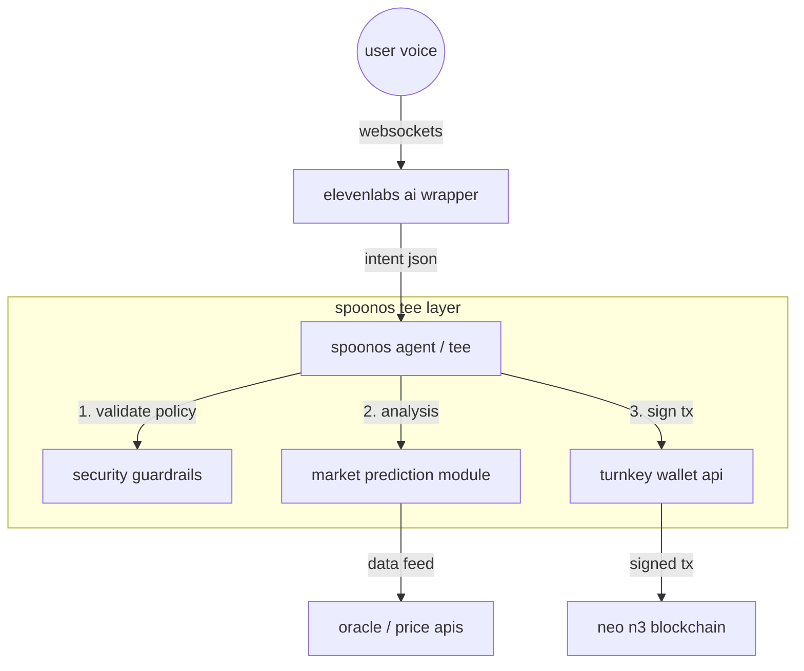

# flowchain - voice-native smart crypto wallet
   
## 1. abstract

**flowchain** is a voice-activated agentic interface for the neo blockchain, designed to eliminate the latency and physical constraints of traditional hardware and browser-based wallets. by leveraging **spoonos** for secure trusted execution environments (tees) and **elevenlabs** for low-latency conversational i/o, flowchain enables hands-free high-frequency trading and acts as a fail-safe security layer.

the system introduces the concept of **"verbal atomic execution"**—allowing users to trigger complex transaction batches (swaps, bridging, or emergency liquidity draining) via authenticated voice commands, secured by cryptographic proofs within the spoonos infrastructure.

## 2. architecture

the system follows an architecture anchored by the **spoonos agent framework**.



## 3. core components

#### a. the spoonos guardian (backend)

built using the `spoon-ai-sdk` (python), the agent runs inside a trusted execution environment.

  * **role:** maintains the session state and executes logic.
  * **security:** utilizing spoonos tees ensures that the private key management and transaction signing logic cannot be tampered with by the host server.
  * **compliance:** implements a "policy engine" that rejects transactions exceeding specific risk thresholds unless an explicit high-entropy voice override (safe word) is provided.

#### b. elevenlabs conversational interface (i/o)

we utilize **elevenlabs conversational ai** via websockets for sub-200ms latency.

  * **input:** real-time speech-to-text streams user commands.
  * **output:** dynamic text-to-speech provides execution confirmation and market summaries.
  * **context awareness:** the voice model adapts its tone based on the **market intelligence module**—calm during stability, urgent during volatility.

#### c. turnkey api & neo integration

  * **wallet management:** non-custodial key management integrated via api, allowing the spoonos agent to sign transactions programmatically without exposing keys to the frontend client.
  * **neo n3:** native support for gas calculation and invocation of neo smart contracts.
  * **hands-free trading**
    * *"swap 50 gas for neo at market price."*
    * *"check my pnl for the last 24 hours."*
    * *"what is the current apy on flamingo finance?"*

#### d. market prediction software

 * **the prediction software is detailed in greater depth in the prediction folder :)**


## 4. setup

a. **clone and install dependencies**

   ```bash
   git clone https://github.com/your-team/flowchain.git
   cd flowchain
   pip install -r requirements.txt
   ```

b. **configure environment variables**

   create a `.env` file in the root directory:

   ```ini
   # required
   GEMINI_API_KEY=your_gemini_api_key
   
   # neo wallet
   NEO_WIF=your_neo_private_key_wif
   NEO_ADDRESS=your_neo_address
   NEO_RPC_URL=https://testnet1.neo.coz.io:443
   
   # voice (optional)
   ELEVENLABS_API_KEY=your_elevenlabs_key
   ENABLE_VOICE=true
   
   # research tools (optional)
   TAVILY_API_KEY=your_tavily_key
   SANTIMENT_API_KEY=your_santiment_key
   ```

c. **run the prediction pipeline** (generates trade recommendations)

   ```bash
   python3 prediction_model/run_pipeline.py
   ```

d. **start the agent**

   option a: cli mode
   ```bash
   python3 src/main.py
   ```

   option b: web interface with voice
   ```bash
   python3 run_server.py
   ```
   then open `http://localhost:8000` in your browser

### usage examples

once running, you can interact with flowchain:

- *"what are my holdings?"* → shows real neo wallet balance
- *"any trade recommendations?"* → reads from prediction model
- *"what's happening with bitcoin?"* → web3 research analysis
- *"what should i buy?"* → combines predictions with market datay the code running inside the enclave is the genuine, uncorrupted version of flowchain.

## 5. hackathon tracks & alignment

### 🤖 ai agent for web3
fully autonomous agent performing on-chain writes (swaps/transfers) based on natural language reasoning. the spoonos guardian maintains session state, validates policies, and executes blockchain transactions via the turnkey wallet api—all triggered by voice commands.

### 📈 ai prediction track
our prediction_model acts as an intelligent trading engine that turns messy signals—news headlines, tweets, on-chain data—into clear sentiment scores. these scores are processed through advanced financial algorithms:
  * **black-litterman model:** blends market priors with investor views using uncertainty covariance to compute posterior expected returns.
  * **kelly criterion:** derives optimal leverage fraction maximizing geometric growth, modified for short-selling.
  * **risk controls:** strict drawdown constraints and max-position limits (70%) for capital preservation.
  * **neural processing:** tensorflow/keras bidirectional lstm for macroeconomic sentiment extraction.

the pipeline outputs mathematically optimized trade plans to `final_trade_plan.txt` for execution by the voice agent.

### 🎙️ elevenlabs challenge
deep integration of elevenlabs conversational ai via websockets for sub-200ms latency voice interaction. the system provides:
  * real-time speech-to-text for user commands
  * dynamic text-to-speech for execution confirmations and market summaries
  * context-aware tone adaptation—calm during market stability, urgent during volatility
