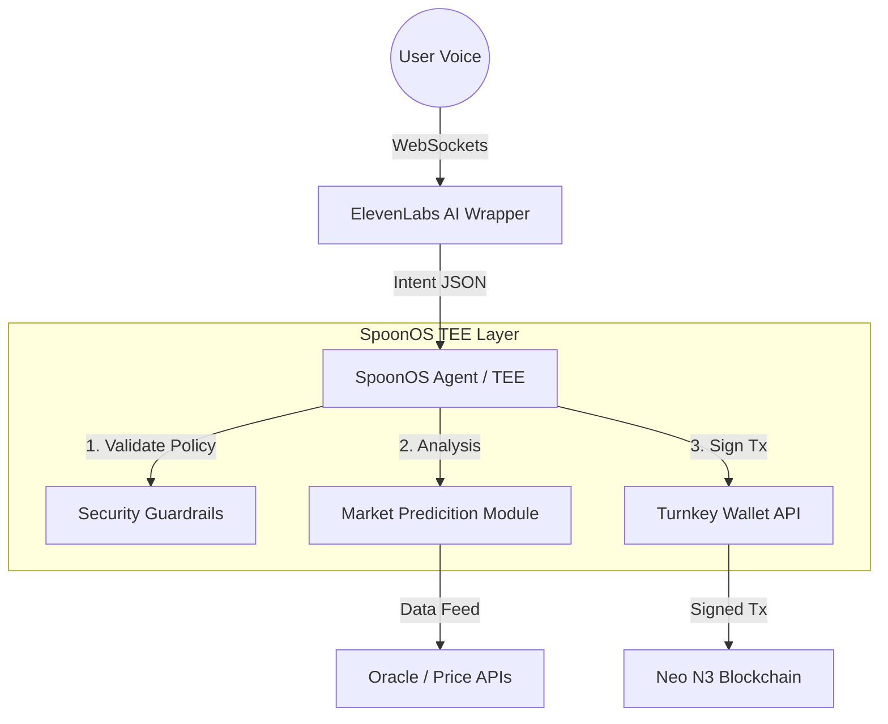

x# flowchain - Voice-Native Smart Crypto Wallet
   
## 1\. Abstract

**flowchain** is a non-custodial, voice-activated agentic interface for the Neo blockchain, designed to eliminate the latency and physical constraints of traditional hardware and browser-based wallets. By leveraging **SpoonOS** for secure Trusted Execution Environments (TEEs) and **ElevenLabs** for low-latency conversational I/O, VoxAegis enables hands-free high-frequency trading and acts as a fail-safe security layer.

The system introduces the concept of **"Verbal Atomic Execution"**—allowing users to trigger complex transaction batches (swaps, bridging, or emergency liquidity draining) via authenticated voice commands, secured by cryptographic proofs within the SpoonOS infrastructure.

## 2\. Problem Statement

In high-volatility DeFi environments, the time-to-execution for human traders is bottlenecked by physical interface interactions (login, 2FA, clicking UI elements). Furthermore, in the event of a physical security compromise (e.g., laptop seizure) or a compromised dApp frontend, users lack an "out-of-band" method to secure their assets. VoxAegis solves this by decoupling execution from the physical device, placing the logic inside a secure, voice-gated TEE.

## 3\. Architecture

The system follows a hub-and-spoke architecture anchored by the **SpoonOS Agent Framework**.



### Core Components

#### A. The SpoonOS Guardian (Backend)

Built using the `spoon-ai-sdk` (Python), the agent runs inside a Trusted Execution Environment.

  * **Role:** Maintains the session state and executes logic.
  * **Security:** Utilizing SpoonOS TEEs ensures that the private key management and transaction signing logic cannot be tampered with by the host server.
  * **Compliance:** Implements a "Policy Engine" that rejects transactions exceeding specific risk thresholds unless an explicit high-entropy voice override (Safe Word) is provided.

#### B. ElevenLabs Conversational Interface (I/O)

We utilize **ElevenLabs Conversational AI** via WebSockets for sub-200ms latency.

  * **Input:** Real-time speech-to-text streams user commands.
  * **Output:** Dynamic text-to-speech provides execution confirmation and market summaries.
  * **Context Awareness:** The voice model adapts its tone based on the **Market Intelligence Module**—calm during stability, urgent during volatility.

#### C. Turnkey API & Neo Integration

  * **Wallet Management:** Non-custodial key management integrated via API, allowing the SpoonOS agent to sign transactions programmatically without exposing keys to the frontend client.
  * **Neo N3:** Native support for GAS calculation and invocation of Neo smart contracts.

## 4\. Key Features

### 🛡️ Emergency Killswitch (Protocol Zero)

A dedicated logic flow designed for immediate asset protection. Upon recognizing a specific distress phrase, the agent bypasses standard confirmation loops and executes an atomic batch:

1.  **Revoke:** Cancels all token approvals on known DEX routers.
2.  **Drain:** Transfers all native NEO/GAS and NEP-17 assets to a pre-defined cold storage address.
3.  **Lock:** Terminates the active agent session.

### 🧠 Market Intelligence & Prediction

A background thread within the agent continuously polls on-chain metrics and sentiment data.

  * **Daily Briefing:** A synthesized summary of the Neo ecosystem state.
  * **Predictive Heuristics:** The agent utilizes simple regression models to flag unusual volume spikes, proactively suggesting entry/exit points via voice before the user initiates a query.

### 🗣️ Hands-Free Trading

  * *"Swap 50 GAS for NEO at market price."*
  * *"Check my PnL for the last 24 hours."*
  * *"What is the current APY on Flamingo Finance?"*

## 5\. Technology Stack

  * **Agent Runtime:** Python 3.10+, SpoonOS SDK
  * **Voice Processing:** ElevenLabs Python SDK (Conversational Agent)
  * **Blockchain:** Neo-mamba (Python SDK for Neo), Neo N3 Testnet
  * **Wallet Infrastructure:** Turnkey API / Local TEE Enclave signing

## 6\. Installation & Setup

### Prerequisites

  * Python 3.10+
  * SpoonOS CLI installed (`pip install spoon-cli`)
  * ElevenLabs API Key
  * Neo N3 Testnet Wallet (Private Key for Agent or API Signer)

### Quick Start

1.  **Clone the Repository**

    ```bash
    git clone https://github.com/your-team/vox-aegis.git
    cd vox-aegis
    ```

2.  **Configure Environment**
    Create a `.env` file based on `.env.example`:

    ```ini
    SPOON_API_KEY=sp_...
    ELEVENLABS_API_KEY=xi_...
    NEO_PRIVATE_KEY_WIF=...
    COLD_STORAGE_ADDRESS=N...
    ```

3.  **Initialize SpoonOS Agent**

    ```bash
    # Registers the agent with the SpoonOS coordination layer
    spoon-cli init --config agent_config.json
    ```

4.  **Run the Sentinel**

    ```bash
    python src/main.py
    ```

## 7\. Security Considerations

  * **Voice Spoofing:** In a production environment, we would implement Voice ID verification to prevent unauthorized access via recording playback.
  * **TEE Attestation:** We rely on SpoonOS's native remote attestation to verify the code running inside the enclave is the genuine, uncorrupted version of VoxAegis.

## 8\. Hackathon Tracks & Alignment

  * **AI Agent with Web3:** Fully autonomous agent performing on-chain writes (swaps/transfers) based on natural language reasoning.
  * **ElevenLabs Challenge:** Deep integration of the Conversational AI websocket for low-latency command and control.

-----

*Built for the Encode Club x SpoonOS Agentic Hackathon 2025.*
