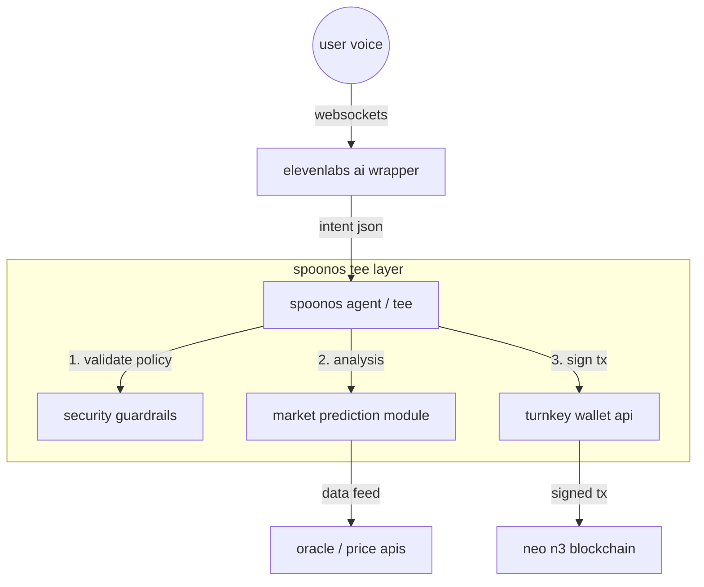

# flowchain - voice-native smart crypto wallet
   
## 1. abstract

**flowchain** is a voice-activated agentic interface for the neo blockchain, designed to eliminate the latency and physical constraints of traditional hardware and browser-based wallets. by leveraging **spoonos** for secure trusted execution environments (tees) and **elevenlabs** for low-latency conversational i/o, flowchain enables hands-free high-frequency trading and acts as a fail-safe security layer.

the system introduces the concept of **"verbal atomic execution"**—allowing users to trigger complex transaction batches (swaps, bridging, or emergency liquidity draining) via authenticated voice commands, secured by voice validation within the spoonos infrastructure.

## 2. architecture

the system follows an architecture anchored by the **spoonos agent framework**.



## 3. core components

#### a. the spoonos guardian (backend)

built using the `spoon-ai-sdk` (python), the agent runs inside a trusted execution environment.

#### b. elevenlabs conversational interface (i/o)

we utilize **elevenlabs conversational ai** via websockets for sub-200ms latency. real-time speech-to-text streams user commands

#### c. turnkey api & neo integration

non-custodial key management integrated via api, allowing the spoonos agent to sign transactions programmatically without exposing keys to the frontend client.

#### d. market prediction software

 * **the prediction software is detailed in greater depth in the prediction folder :)**


## 4. setup

a. **clone and install dependencies**

   ```bash
   git clone https://github.com/your-team/flowchain.git
   cd flowchain
   pip install -r requirements.txt
   ```

b. **configure environment variables**

   create a `.env` file in the root directory:

   ```ini
   # required
   GEMINI_API_KEY=your_gemini_api_key
   
   # neo wallet
   NEO_WIF=your_neo_private_key_wif
   NEO_ADDRESS=your_neo_address
   NEO_RPC_URL=https://testnet1.neo.coz.io:443
   
   # voice (optional)
   ELEVENLABS_API_KEY=your_elevenlabs_key
   ENABLE_VOICE=true
   
   # research tools (optional)
   TAVILY_API_KEY=your_tavily_key
   SANTIMENT_API_KEY=your_santiment_key
   ```

c. **run the prediction pipeline** (generates trade recommendations)

   ```bash
   python3 prediction_model/run_pipeline.py
   ```

d. **start the agent**

   option a: cli mode
   ```bash
   python3 src/main.py
   ```

   option b: web interface with voice
   ```bash
   python3 run_server.py
   ```
   then open `http://localhost:8000` in your browser

### usage examples

once running, you can interact with flowchain:

- *"what are my holdings?"* → shows real neo wallet balance
- *"any trade recommendations?"* → reads from prediction model
- *"what's happening with bitcoin?"* → web3 research analysis
- *"what should i buy?"* → combines predictions with market datay the code running inside the enclave is the genuine, uncorrupted version of flowchain.
