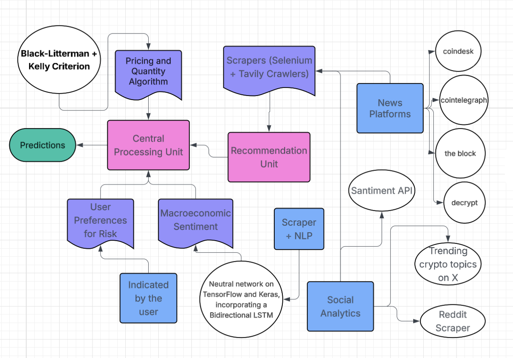

# prediction_model pipeline architecture

## system overview

the prediction_model acts as an intelligent trading engine for crypto assets. instead of just tracking prices, it runs a data pipeline that turns messy signals—like news headlines and tweets—into clear sentiment scores. these scores are then processed by advanced financial algorithms (black-litterman and kelly criterion) to output a strict, mathematically optimized trade plan designed to maximize returns while managing risk.

## architecture flow



the system utilizes a convergent processing topology to synthesize heterogeneous market signals into clear trading recommendations

### 1. data ingestion layer
parallel ingestion of high-fidelity market data streams:
- **news**: automated crawling of primary crypto-journalism nodes (coindesk, cointelegraph, the block, decrypt).
- **social sentiment**: extraction of community sentiment vectors via tavily-powered scraping of reddit threads and trending "crypto topics on x".
- **on-chain data**: injection of on-chain network state metrics via santiment api.

### 2. neural processing & signal extraction
routing of raw data streams through specialized analytical kernels:
- **text processing**: tensorflow/keras-based bidirectional lstm deriving macroeconomic sentiment scores from linguistic inputs.
- **asset signals**: parsing of social/news feeds into asset-specific sentiment vectors.

### 3. central aggregation engine
convergence point for disparate signal synthesis:
- **sentiment & risk**: integration of global market regime indicators with user-defined capital exposure limits.
- **pricing logic**: mathematical harmonization of subjective investor views with objective market equilibrium.

### 4. optimization engine
stochastic optimization for final trade plan generation:
- **view mapping**: transformation of scalar sentiment scores into implied excess return vectors ($E[R]$) and confidence matrices ($\Omega$).
- **black-litterman**: computation of posterior expected returns $E[R|views]$ via blending of market priors ($\Pi$) and investor views ($Q$) using uncertainty covariance ($\tau\Sigma$).
- **kelly criterion**: derivation of optimal leverage fraction $f^*$ maximizing geometric growth: $f^* = \frac{p - q}{b}$, modified for short-selling.
- **risk controls**: application of strict drawdown constraints and max-position limits (currently 70%) for capital preservation.

## usage protocol

execute the orchestration script to trigger the etl and optimization sequence:

```bash
source .venv/bin/activate
python prediction_model/run_pipeline.py
```

## artifacts

- **output**: `final_trade_plan.txt` (serialized directives for execution agents).
- **logs**: stdout stream containing granular stage-gate metrics.

## dependencies

- `numpy`, `pandas`: matrix operations.
- `selenium`, `feedparser`: ingestion drivers.
- `tensorflow`: legacy dependency for transformer models.

