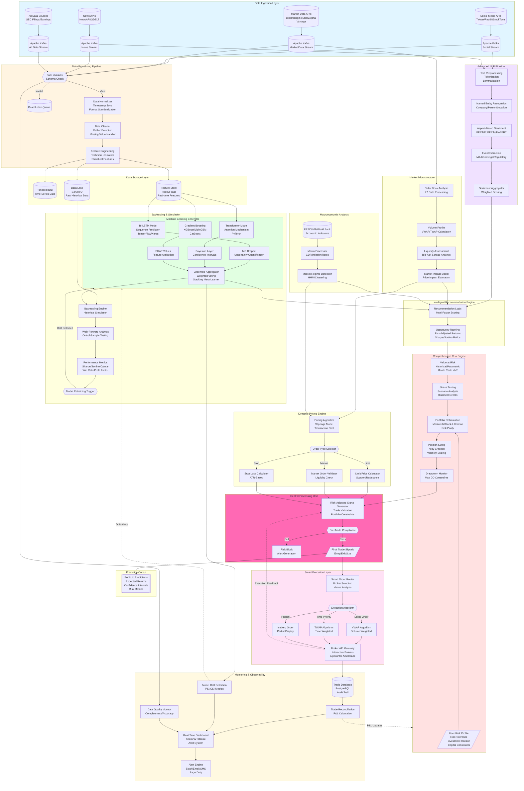

# Prediction System Architecture

```mermaid

flowchart TB
    subgraph DataIngestion["Data Ingestion Layer"]
        API1[("Market Data APIs<br/>Bloomberg/Reuters/Alpha Vantage")]
        API2[("Social Media APIs<br/>Twitter/Reddit/StockTwits")]
        API3[("News APIs<br/>NewsAPI/GDELT")]
        API4[("Alt Data Sources<br/>SEC Filings/Earnings")]
        
        API1 --> Kafka1[("Apache Kafka<br/>Market Data Stream")]
        API2 --> Kafka2[("Apache Kafka<br/>Social Stream")]
        API3 --> Kafka3[("Apache Kafka<br/>News Stream")]
        API4 --> Kafka4[("Apache Kafka<br/>Alt Data Stream")]
    end
    
    subgraph DataPipeline["Data Processing Pipeline"]
        Kafka1 & Kafka2 & Kafka3 & Kafka4 --> Validator{{"Data Validator<br/>Schema Check"}}
        Validator -->|Valid| Normalizer["Data Normalizer<br/>Timestamp Sync<br/>Format Standardization"]
        Validator -->|Invalid| DLQ[("Dead Letter Queue")]
        
        Normalizer --> Cleaner["Data Cleaner<br/>Outlier Detection<br/>Missing Value Handler"]
        Cleaner --> FeatureEng["Feature Engineering<br/>Technical Indicators<br/>Statistical Features"]
    end
    
    subgraph Storage["Data Storage Layer"]
        FeatureEng --> TimeSeries[("TimescaleDB<br/>Time-Series Data")]
        FeatureEng --> FeatureStore[("Feature Store<br/>Redis/Feast<br/>Real-time Features")]
        FeatureEng --> DataLake[("Data Lake<br/>S3/MinIO<br/>Raw Historical Data")]
    end
    
    subgraph NLP["Advanced NLP Pipeline"]
        Kafka2 & Kafka3 --> PreProcess["Text Preprocessing<br/>Tokenization<br/>Lemmatization"]
        PreProcess --> NER["Named Entity Recognition<br/>Company/Person/Location"]
        NER --> AspectSentiment["Aspect-Based Sentiment<br/>BERT/RoBERTa/FinBERT"]
        AspectSentiment --> EventExtract["Event Extraction<br/>M&A/Earnings/Regulatory"]
        EventExtract --> SentimentAgg["Sentiment Aggregator<br/>Weighted Scoring"]
    end
    
    subgraph MacroAnalysis["Macroeconomic Analysis"]
        MacroData[("FRED/IMF/World Bank<br/>Economic Indicators")]
        MacroData --> MacroProcessor["Macro Processor<br/>GDP/Inflation/Rates"]
        MacroProcessor --> RegimeDetect["Market Regime Detection<br/>HMM/Clustering"]
    end
    
    subgraph Microstructure["Market Microstructure"]
        Kafka1 --> OrderBook["Order Book Analysis<br/>L2 Data Processing"]
        OrderBook --> VolumeProfile["Volume Profile<br/>VWAP/TWAP Calculation"]
        VolumeProfile --> LiquidityModel["Liquidity Assessment<br/>Bid-Ask Spread Analysis"]
        LiquidityModel --> ImpactModel["Market Impact Model<br/>Price Impact Estimation"]
    end
    
    subgraph MLEnsemble["Machine Learning Ensemble"]
        FeatureStore --> LSTM["Bi-LSTM Model<br/>Sequence Prediction<br/>TensorFlow/Keras"]
        FeatureStore --> Transformer["Transformer Model<br/>Attention Mechanism<br/>PyTorch"]
        FeatureStore --> GBM["Gradient Boosting<br/>XGBoost/LightGBM<br/>CatBoost"]
        
        LSTM --> Uncertainty1["MC Dropout<br/>Uncertainty Quantification"]
        Transformer --> Uncertainty2["Bayesian Layer<br/>Confidence Intervals"]
        GBM --> Uncertainty3["SHAP Values<br/>Feature Attribution"]
        
        Uncertainty1 & Uncertainty2 & Uncertainty3 --> Ensemble["Ensemble Aggregator<br/>Weighted Voting<br/>Stacking Meta-Learner"]
    end
    
    subgraph RecommendationEngine["Intelligent Recommendation Engine"]
        SentimentAgg --> RecEngine["Recommendation Logic<br/>Multi-Factor Scoring"]
        ImpactModel --> RecEngine
        Ensemble --> RecEngine
        RegimeDetect --> RecEngine
        
        RecEngine --> OpportunityRank["Opportunity Ranking<br/>Risk-Adjusted Returns<br/>Sharpe/Sortino Ratios"]
    end
    
    subgraph RiskEngine["Comprehensive Risk Engine"]
        UserRisk[/"User Risk Profile<br/>Risk Tolerance<br/>Investment Horizon<br/>Capital Constraints"/]
        
        OpportunityRank --> VaRCalc["Value at Risk<br/>Historical/Parametric<br/>Monte Carlo VaR"]
        VaRCalc --> StressTest["Stress Testing<br/>Scenario Analysis<br/>Historical Events"]
        StressTest --> PortOpt["Portfolio Optimization<br/>Markowitz/Black-Litterman<br/>Risk Parity"]
        
        UserRisk --> PortOpt
        PortOpt --> PositionSize["Position Sizing<br/>Kelly Criterion<br/>Volatility Scaling"]
        PositionSize --> DrawdownMon["Drawdown Monitor<br/>Max DD Constraints"]
    end
    
    subgraph PricingEngine["Dynamic Pricing Engine"]
        ImpactModel --> PriceAlgo["Pricing Algorithm<br/>Slippage Model<br/>Transaction Cost"]
        RegimeDetect --> PriceAlgo
        PriceAlgo --> OrderType{{"Order Type Selector"}}
        
        OrderType -->|Limit| LimitCalc["Limit Price Calculator<br/>Support/Resistance"]
        OrderType -->|Market| MarketCalc["Market Order Validator<br/>Liquidity Check"]
        OrderType -->|Stop| StopCalc["Stop Loss Calculator<br/>ATR-Based"]
    end
    
    subgraph CentralProcessor["Central Processing Unit"]
        DrawdownMon --> CPU["Risk-Adjusted Signal Generator<br/>Trade Validation<br/>Portfolio Constraints"]
        LimitCalc & MarketCalc & StopCalc --> CPU
        
        CPU --> PreTradeCheck{{"Pre-Trade Compliance"}}
        PreTradeCheck -->|Pass| TradeSignal[/"Final Trade Signals<br/>Entry/Exit/Size"/]
        PreTradeCheck -->|Fail| RiskBlock["Risk Block<br/>Alert Generation"]
    end
    
    subgraph ExecutionLayer["Smart Execution Layer"]
        TradeSignal --> Router["Smart Order Router<br/>Broker Selection<br/>Venue Analysis"]
        Router --> ExecAlgo{{"Execution Algorithm"}}
        
        ExecAlgo -->|Large Order| VWAP["VWAP Algorithm<br/>Volume Weighted"]
        ExecAlgo -->|Time Priority| TWAP["TWAP Algorithm<br/>Time Weighted"]
        ExecAlgo -->|Hidden| Iceberg["Iceberg Order<br/>Partial Display"]
        
        VWAP & TWAP & Iceberg --> BrokerAPI["Broker API Gateway<br/>Interactive Brokers<br/>Alpaca/TD Ameritrade"]
    end
    
    subgraph Backtesting["Backtesting & Simulation"]
        DataLake --> BackEngine["Backtesting Engine<br/>Historical Simulation"]
        Ensemble --> BackEngine
        
        BackEngine --> WalkForward["Walk-Forward Analysis<br/>Out-of-Sample Testing"]
        WalkForward --> PerfMetrics["Performance Metrics<br/>Sharpe/Sortino/Calmar<br/>Win Rate/Profit Factor"]
        PerfMetrics --> ModelUpdate{{"Model Retraining Trigger"}}
        
        ModelUpdate -->|Drift Detected| MLEnsemble
    end
    
    subgraph Monitoring["Monitoring & Observability"]
        BrokerAPI --> TradeLog[("Trade Database<br/>PostgreSQL<br/>Audit Trail")]
        TradeLog --> Reconcile["Trade Reconciliation<br/>P&L Calculation"]
        
        Ensemble --> ModelMonitor["Model Drift Detection<br/>PSI/CSI Metrics"]
        Validator --> DataQuality["Data Quality Monitor<br/>Completeness/Accuracy"]
        
        Reconcile & ModelMonitor & DataQuality --> Dashboard["Real-Time Dashboard<br/>Grafana/Tableau<br/>Alert System"]
        Dashboard --> Alerting["Alert Engine<br/>Slack/Email/SMS<br/>PagerDuty"]
    end
    
    subgraph Predictions["Prediction Output"]
        TradeSignal --> PredDisplay[["Portfolio Predictions<br/>Expected Returns<br/>Confidence Intervals<br/>Risk Metrics"]]
    end
    
    BrokerAPI -.->|Execution Feedback| CPU
    Reconcile -.->|P&L Updates| RiskEngine
    ModelMonitor -.->|Drift Alerts| MLEnsemble
    
    style DataIngestion fill:#e1f5ff
    style DataPipeline fill:#fff4e1
    style NLP fill:#f0e1ff
    style MLEnsemble fill:#e1ffe1
    style RiskEngine fill:#ffe1e1
    style ExecutionLayer fill:#ffe1f5
    style Monitoring fill:#fff9e1
    style CentralProcessor fill:#ff69b4


```